# Hilando datos en cuarentena: metodología y ejercicios para elaborar una bitácora textil

  

## INTRODUCCIÓN

## Hilando datos consiste en una serie de exploraciones pedagógicas y artísticas enfocadas en el uso de prácticas textiles para el uso, procesamiento y divulgación de datos como posibles herramientas para el activismo.

## Hilando datos es parte fundamental del proyecto [Agujas Combativas](https://agujascombativas.hotglue.me/), un proyecto de investigación, pedagogías y divulgación de herramientas para el activismo textil. [Agujas Combativas](https://agujascombativas.hotglue.me/) es una iniciativa que resultó del afortunado encuentro entre SocialTIC y Daniela Whaley.

## ¿QUÉ PASÓ?

El taller Bitácora Textil es una propuesta diseñada por Daniela Whaley junto con integrantes del equipo de Social TIC: Diana González, Haydée Quijano y Frida García como continuación del primer taller[ Hilando Datos](https://socialtic.org/blog/hilandodatos-como-bordar-visualizaciones-de-datos/). Surge a partir de la inquietud por registrar el fenómeno de aislamiento social provocado por el Covid-19. Daniela inspirada por el trabajo de la diseñadora Giorgia Lupi y su línea de trabajo de [\#Datahumanism](https://medium.com/@giorgialupi/data-humanism-the-revolution-will-be-visualized-31486a30dbfb) nos ha sumergido en este viaje para relacionarnos con los datos desde una mirada más humana.

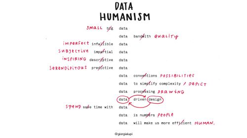

El taller Bitácora Textil propone entender y compartir desde la distancia y a través de medios virtuales las nuevas formas que el mundo ha encontrado para habitar la pandemia. En él se observaron, registraron, visualizaron y bordaron los hábitos cotidianos de lxs participantes. El taller transcurrió en los meses de junio y julio de 2020 en el que se trabajaron 7 ejercicios previamente estructurados enfocados en aspectos sociales, culturales y económicos de las personas durante la cuarentena.

## DESCRIPCIÓN DE SESIONES

El taller utilizó como recurso de comunicación y trabajo un grupo privado de Facebook \(grupo de aprendizaje\) y las 3 sesiones en línea se hicieron mediante Zoom. Las sesiones trataron: las etapas del procesamiento de datos, ejemplos de visualizaciones de datos con textil, algunos proyectos de activismo textil y la posibilidad de generar otras escrituras con ayuda de estas herramientas, tema que fue abordado por Daniela Hauri de [@minar\_edicionestextiles](https://www.instagram.com/minar_edicionestextiles/).

Cada ejercicio se componía de temática, preguntas guía, propuesta de visualización, categorías de medición y recursos e inspiraciones para las visualizaciones. El hecho de que las visualizaciones fueran propuestas previamente realizadas tuvo la finalidad de generar información unificada para poder hacer comprensible la información de la experiencia de aislamiento, como una especie de escritura colectiva.

Los ejercicios realizados se subían a un álbum de fotos destinado a cada uno, fue una manera de compartir y ordenar los avances de lxs participantes. En los álbumes de Facebook cada foto ofrece la posibilidad de escribir un texto en la descripción de la imagen, lo cual dio a lxs participantes un espacio para comunicar sus vivencias particulares, explicar categorías de medición añadidas e incluso las emociones que el ejercicio les provocó.

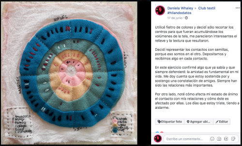

El taller buscaba la apropiación del uso de datos a través de la experiencia, por ello se mantuvo abierta la posibilidad de cambiar, formular y proponer otras formas de registro. Cada ejercicio tiene el toque único de cada participante.

### Ejercicio 1. Espacio habitado

Este ejercicio buscó plasmar la forma en la que hemos habitado los espacios en los que quedamos encerrados durante la cuarentena.

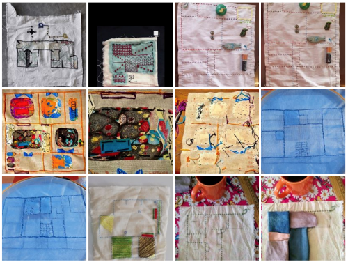

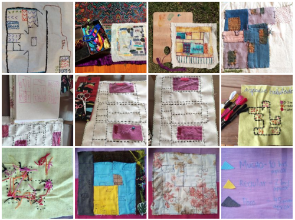

Preguntas guía:

¿Cómo es el espacio en el que estás pasando la cuarentena?¿Cuánto tiempo pasas en cada una de sus áreas? ¿Tuviste que trasladarte a raíz de la contingencia? ¿Qué elementos disfrutas o has tenido que adaptar en el espacio en estos tiempos?

Códigos y categorías de medición:

1. Forma del espacio físico del espacio en el que habitamos = Croquis
2. Tiempo que paso en cada espacio = Color
3. Poco tiempo \(0 a 2 hrs\) / Color más claro
4. Medio tiempo \(2 a 6 horas\)
5. Mucho \(más de 6 horas\) / Color más oscuro
6. Traslado o mudanza = Flecha / Recorrido

### Ejercicio 2. Trabajo

Este ejercicio pretendió retratar una de las situaciones más preocupantes de nuestra actualidad: la justicia laboral y el abanico de las realidades económicas. En este ejercicio medimos la situación laboral y económica de cada participante durante la pandemia mediante el bordado de un paisaje inspirado en el trabajo de María José Durán \([@punto.y.linea.sobre.el.plano](https://www.instagram.com/punto.y.linea.sobre.el.plano/)\).

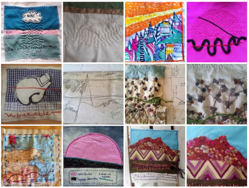

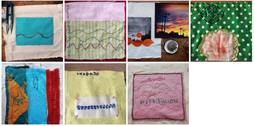

Preguntas guía:

¿De qué fuentes estás obteniendo tu ingreso para estas épocas de encierro? ¿Recibo algún apoyo? ¿Qué porcentaje proviene de cada fuente? ¿Cuál es tu situación laboral actual? ¿Tu trabajo permite quedarte en casa?

Códigos y categorías de medición:

El horizonte del paisaje estaba dado por las fuentes de ingreso:

1. Número y tipo de fuentes de ingreso = color

Ejemplos:

* Trabajo 
* Préstamo bancario 
* Préstamo o apoyo familiar 
* Fuentes alternativas de ingresos 
* Apoyo gobierno
* Porcentaje de ingreso = Proporciones
* Situación Laboral = la tierra del paisaje.
* Conservo mi trabajo y lo realizo desde casa \(paisaje suave y redondeado.\)
* Conservo mi trabajo y debo trasladarme \(paisaje inclinado descendente, una colina en forma de triángulo escaleno\)
* Perdí mi trabajo \( paisaje montañoso, con varios triángulos\)
* Sin empleo desde antes del Covid \(paisaje plano\)

### Ejercicio 3. Contacto Social

#### Este ejercicio registró la convivencia social, las interacciones físicas o digitales durante el aislamiento.

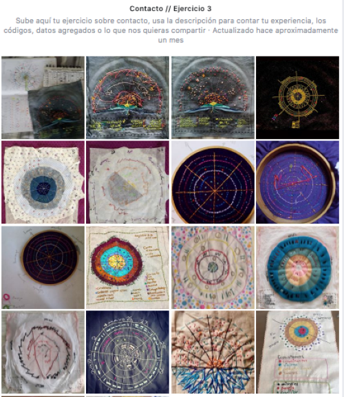

Preguntas guía:

¿Cómo te mantienes en contacto con tus seres queridos? ¿Cómo se juegan los afectos y cercanías sin el contacto físico? ¿Es verdaderamente posible aislarnos?

Códigos y categorías de medición:

1. Cercanía de contacto = círculos concéntricos
2. Cohabitantes:
3. Visitas
4. Contactos fugaces físicos
5. Videollamadas y llamadas
6. Email o chat
7. Tipos de relaciones sociales = color
8. * Animales
9. * Pareja
10. * Familiar \(incluye hijxs\)
11. * Amistad
12. * Colega
13. * Desconocidx o poco conocidx

### Ejercicio 4. Actividades

#### Registrar cómo administramos nuestro tiempo durante la cuarentena.

Preguntas guía:

¿Cómo se ha transformado tu día a día con la cuarentena? ¿A qué actividades dedicas más energía y tiempo?

Códigos y categorías de medición:

1. Tipo de actividades = color o saturación de puntadas
2. Trabajo
3. Comida
4. Labores domésticas
5. Provisiones
6. Cuidado de uno mismo
7. Cuidado de otrxs
8. Traslados
9. Aprendizaje
10. Socializar / Estar con otrxs
11. Recreación
12. Descanso
13. Tiempo = cada línea bordada equivale a 30 min.
14. Presencial o medios digitales = línea bordada atravesada \(en cruz\)

### Ejercicio 5. Salidas

Registrar el motivo y número de salidas que realizamos durante el aislamiento.

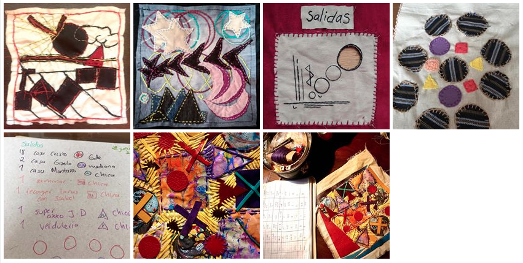

Preguntas guía:

¿Cuáles son las razones por las que decidimos salir? ¿Tu situación laboral te permite quedarte en casa?

Códigos y categorías de medición:

1. Motivos de salida = símbolo
2. Provisiones \(triángulo\)
3. Sociales \(círculo\)
4. Trabajo \(L\)
5. Ejercicio \(gota\)
6. Paseo \(cuadrado\)
7. Traslado \(línea diagonal\)
8. Otros \(x\)
9. Distancia recorrida = tamaño de la figura
10. Cerca \(más pequeño\) de cero a un km
11. Distancia media \(tamaño mediano\) de uno a cinco km
12. Lejos \(más grande\) más de cinco km
13. Cantidad de salidas = yuxtaposición de elementos

### Ejercicio 6. Hábitos del Sueño

Plasmar las horas que pasas durmiendo y la distribución de los horarios de sueño en cuarentena.

Preguntas guía:

¿Cómo has dormido? ¿Te sientes descansadx, energetizadx al despertar o a lo largo del día? ¿Haces siestas?

Códigos y categorías de medición:

En este ejercicio se registrar 3 variables:

1. Horas de sueño = largo de la línea
2. Horario en el que se durmió = posición del bordado. 
3. Calidad del sueño = Grosor de la puntada

### Ejercicio 7. Categoría Libre

Una vez trabajado el procesamiento de datos en categorías preestablecidas, este último ejercicio consistió en proponer libremente categorías de observación y medición desde el entorno propio y explorar las maneras de representarse.

## METODOLOGÍA ¿Cómo procesar datos humanos a través del bordado?

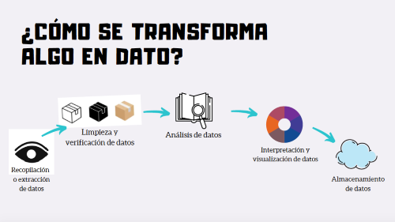

Cuando hablamos del procesamiento de datos pensamos en software o herramientas digitales para analizarlos. Este taller propone utilizar el bordado como un tamiz para procesar información y generar procesos de transformación para la acción social a dos niveles:

**Nivel individual:**

La naturaleza análoga del bordado demanda tiempo y esfuerzo para su realización. El taller plantea que conjuntar el laborioso e íntimo proceso artístico que es el bordado con el uso riguroso y ético de datos puede resultar en un proceso personal de resignificación de la información.

**Nivel colectivo:**

El bordado de datos nos permite utilizar una técnica textil considerada durante mucho tiempo exclusiva para el ámbito doméstico como herramienta para generar contenido de valor político y social. El tiempo invertido y un espacio donde compartir el proceso de construcción de una pieza artística que busca visualizar e informar puede abrir conversaciones y generar comunidades.

Incluso, es posible que el proceso de transformación de la información en acción se multiplique, a su vez también produzca nueva información y resignificación a nivel individual.

La acción lenta del bordado no es automática, durante la práctica se atraviesa por procesos reflexivos. Este medio resulta una oportunidad para pasar tiempo con la información, para mirarla desde ángulos distintos y explorar las formas que ésta puede tomar. A diferencia del procesamiento de datos con un software, el bordado puede funcionar como un medio para sensibilizar sobre los temas que se estén tratando.

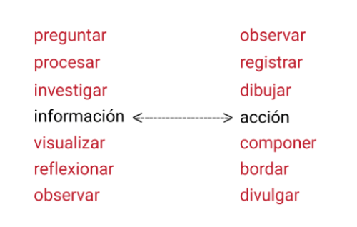

En este caso, las cinco etapas del procesamiento de datos se realizaron en cada uno de los ejercicios

1. Recopilación y extracción de datos. 

En este primer paso se observaron, registraron y contabilizaron los datos necesarios para cada categoría.

Aunque se proporcionaron recursos digitales para el registro de datos \(los datos que recaba Google y hojas de cálculo\) una gran parte de los participantes eligió idear sus propias herramientas para recopilarlos y extraerlos; algunos se apoyaron en aplicaciones, otro en formatos de papel en bitácoras, libretas u hojas, utilizando colores, símbolos u otros elementos para generar sus propios formatos de registro en los que vaciaban la información requerida.

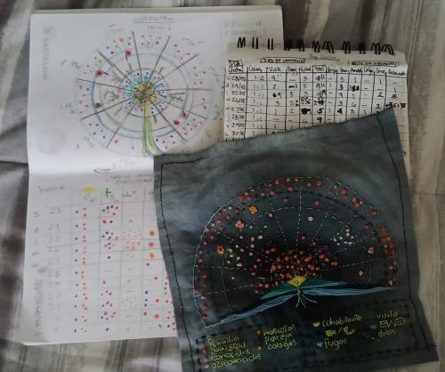

Fue interesante ver cómo cada uno de los participantes se las ingenió para integrar el proceso de registro en su cotidianidad. Algunos decidieron llevar un registro estricto en el que anotaban todas las variables a lo largo del día, se acompañaron de una libreta a todos lados en las que anotaban su día de acuerdo al ejercicio instruido. Otros, simplemente tomaban una hora del día para mantener su registro diario con aproximaciones suficientemente cercanas a la realidad.

La gran parte de los ejercicios planteados en el taller requerían de registros en rangos de días, aunque había un tiempo recomendado de 3 días para el registro, cada participante decidió la cantidad de tiempo y datos que quería recabar. La flexibilidad y ritmo del taller permitieron que algunos registraran hasta 5 o 7 días un mismo ejercicio y se tomaran el tiempo que requerían para registrar y bordar cuanto ellos quisieran.

1. Limpieza y verificación de datos.

Durante el proceso de recopilación de datos, la limpieza y verificación invitaba a realizar constantes procesos de reestructuración para verificar o replantear las variables. Mantener un registro limpio era importante para corregir las posibles equivocaciones y evitar confusiones en el futuro.

Para obtener un registro limpio algunos implementaron mecanismos para recapitular sus días se apoyaban de la memoria, los bosquejos de registro que hacían o el registro de actividad en sus celulares como: chats, llamadas, calendarios de trabajo, etc. A través de ellos consiguieron algunas pistas para reconstruir su día.

Algunas que recabamos son:

* Verificar el día y tiempo en el que se registran las actividades.
* La hoja de cálculo inicialmente propuesta fue modificada en colectivo para que todas las experiencias estuvieran incluidas.

  La categoría de _Mantenimiento y aseo personal \_se transformó en \_Cuidado de unx mismx, \_esto abrió la posibilidad de integrar actividades como terapia, meditación o lecturas por ejemplo. También se decidió añadir una categoría extra para integrar las actividades que tienen que ver con el \_Cuidado de otrxs, \_así la maternidad, el cuidado de padres, familiares, mascotas y plantas fue considerado como una actividad que ocupa tiempo, es particular y no estaba representada por la categoría \_Socializar._

* Considerar que algunas actividades pueden habitar distintas categorías según la experiencia de cada unx. El caso de la actividad _bordar_ es muy significativo; para algunxs significaba tiempo invertido en _Aprendizaje_, para otrxs, _Recreación_, _Trabajo_ o _Cuidado de unx mismx_.
* En algunos casos, el registro del tiempo podría duplicarse en dos apartados por ejemplo: se podía comer y socializar al mismo tiempo así que al revisar el registro cualquiera de las dos actividades podía recordar registrar la otra y en este caso, los días pudieron sumar más de 24 horas al registrar cada diferente actividad. 
* Cambiaron las unidades de medida que mejor se acomodan a su registro personal. 
* Agregar o desechar categorías, para registrar lo que realmente les interesaba documentar de su experiencia. 

La verificación y limpieza de datos, como el resto del proceso, fue de carácter empírico, constantemente aprendían y revaloraban sus formas de registro, los registros se fueron puliendo con el tiempo. Para algunxs, entre más avanzamos más inmersos estaban en la experiencia ideando las formas de expresar su propia vivencia. Para otrxs, el proceso resultó frustrante y decidieron abandonar las actividades del taller por la disciplina de observación que requería el proceso.

1. Análisis de Datos

Desde la experiencia del bordado, el análisis de datos se realiza durante el proceso de registro y visualización. Contrario a las técnicas convencionales más metodológicas, enfocadas en producir salidas de información eficientes para generar conclusiones, el proceso del bordado y el dibujo, nos permitieron examinar los datos humanos como una experiencia única y cercana que atraviesa el cuerpo mediante un proceso tardado y reiterativo \(puntada a puntada\) para permanecer constantemente confrontados con el presente durante la creación de una pieza.

Después del tiempo bordando datos sobre el aislamiento, lxs participantes manifestaron las transformaciones personales, sociales, económicas y culturales que sufrían durante la pandemia. El ejercicio de análisis individual pasó también al plano colectivo al compartir todos sus procesos creativos mediante videollamadas, fotografías, comentarios, e incluso reacciones \(likes\), las narración de las vivencias individuales se convertían en compañía para otros y sirvieron para entender o identificarse como grupo.

1. Interpretación y visualización de datos

La interpretación y visualización de los datos se realizó al finalizar cada uno de los ejercicios a través de las piezas bordadas. Cada participante, al terminar su ejercicio subía una fotografía de su bordado en el álbum de Facebook correspondiente, contextualizando su experiencia al realizar la pieza, la interpretación y apropiación de las categorías de medición, los retos técnicos e incluso emociones por las que atravesaban al momento.

El hecho de compartir categorías de medición y estructuras para las visualizaciones desarrolló una especie de escritura colectiva que nos permitió leer las coincidencias, diferencias y particularidades de cada bordado/experiencia.

Fue un ejercicio interesante donde la creatividad fue un medio para representar los elementos que las personas consideraron importantes. La perfección o la belleza de los bordados se manifestó desde un segundo plano, abriendo más posibilidades para esta práctica, como una vía para comunicar información.

1. Almacenamiento de datos

Para el almacenamiento de datos se eligieron diferentes espacios y formatos en los que la información que se produjo durante el taller quedará almacenada:

1. Al comienzo, como enuncia el nombre del taller, se planteó como producto final la realización de una bitácora textil constituida por los 7 ejercicios realizados. Esta idea fue inspirada por el trabajo de Minar, una editorial textil chilena que abre nuevas posibilidades para la escritura desde la realización de fanzines y libros hechos con distintas técnicas textiles.

   Por ello, Daniela Hauri, fundadora de Minar, fue la invitada especial a la sesión de cierre del taller en Zoom desde Loncoche, Chile. Desde su experiencia explorando estos formatos textiles, nos compartió procesos, ideas y abrió preguntas y posibilidades para la estructura de las piezas finales.

2. Dada la naturaleza lenta del bordado, la realización de una bitácora al finalizar el taller resultó apresurado para algunos integrantes del grupo. Por ello, se propuso como alternativa la realización de una [página web](https://agujascombativas.hotglue.me/bitacora-cuarentena) para compartir la experiencia. La página se realizó en conjunto con algunas integrantes del taller: se discutieron los temas relevantes, lo que resultaba significativo compartir de la experiencia, el diseño, se dividieron las tareas y se lanzó una página como parte del sitio [Agujas Combativas](https://agujascombativas.hotglue.me/), proyecto de activismo textil que seguirá explorando las posibilidades de [\#hilandodatos.](https://agujascombativas.hotglue.me/hilandodatos)
3. El grupo de Facebook donde quedaron registrados los ejercicios individuales y el proceso de acompañamiento que hicieron lxs participantes entre ellxs.
4. También se elaboró este documento abierto al público para explicar el ejercicio y  exponer algunos de los resultados obtenidos. 

## CONSIDERACIONES PARA UN TALLER EN LÍNEA

La planeación del taller fue realizada bajo el contexto de aislamiento provocado por el COVID-19 por lo que su naturaleza análoga fue adaptada a recursos digitales.

Te compartimos algunas consideraciones que pueden ser útiles en el momento de planeación de pedagogías en línea. Para profundizar te recomendamos el audio de la [segunda sesión de Pedagogías de la Irrealidad](https://iberodocslab.org/2020/05/24/audio-de-la-sesion-pedagogia-artistica-y-clases-a-distancia/) llevada por Pablo Martínez Zárate del Laboratorio Iberoamericano de Documental.

Aquí un esquema de diseño posible para la definición de las condiciones del curso:

* Temporalidad y frecuencia. 

¿Cuánto va a durar? ¿Cuáles son los objetivos de aprendizaje por sesión? ¿Cuántas sesiones realizaré? ¿Con qué periodicidad?

* Objetivos de aprendizaje 

¿Qué deseo compartir en el curso? ¿Cuáles son mis objetivos de aprendizaje y temporalidades?

* Tipos de actividades: exposición, producción de obra, escritura \(diarios de creación\), otras entregas
* Tipos de comunicación: seguimiento general del curso, presentación de discusiones teóricas, talleres grupales sobre ejercicios o avances, retroalimentación uno a uno, entre otras.
* Flujos de comunicación: sincrónico y asincrónico. 

¿Qué actividades se realizan en conjunto y cuáles se realizan de manera individual y no tienen que ser presentadas por o en el grupo?

* Herramientas de comunicación: correo electrónico, aplicaciones de mensajería \(Whats App\), plataformas institucionales \(CMS como Blackboard, Moodle, Brighspace, Schoology\), plataformas privadas de almacenamiento \(nube de Google, Outlook, etc\), plataformas de videoconferencia \(Google Meet, Zoom, Jitsi, etc.\), redes sociales \(Facebook, Instagram\).
* Objetivos de comunicación: los objetivos de comunicación según los objetivos de aprendizaje y las actividades, así como la infraestructura de la clase, son los que guían el proceso de diseño tecnológico.

Los recursos que utilizamos fueron:

* Correo electrónico / Se utilizó para iniciar la comunicación con los participantes, sentar las bases, reglas y estructura del taller.
* Grupo privado de Facebook \(modalidad: Grupo de aprendizaje\) / Los ejercicios se publicaban periódicamente en las Unidades de Aprendizaje y los resultados se organizaron y publicaron en Álbumes. 
* Nube de Google / Se utilizaron carpetas para compartir recursos, realización de hojas de cálculo y planeación general del taller.
* Jitsi y Zoom / Primero se planteó utilizar Jitsi para las sesiones con videollamadas, pero a causa de los problemas técnicos por la cantidad de participantes decidimos mudar las sesiones a Zoom. En Jitsi quedó abierta una sala de bordado como espacio de encuentro libre para lxs participantes. 

## LECCIONES Y APRENDIZAJES

* **Apertura a los cambios y dinámicas de escucha.** Al inicio del taller se realizó una duración del taller de poco menos de un mes para realizar los ejercicios planteados, durante el desarrollo nos vimos en la necesidad de replantear los tiempos de los ejercicios dado que el registro y el bordado estaban tomando mayor tiempo para los participantes. Incluso se realizó una encuesta grupal para sugerir la ampliación del tiempo del taller y periodos de tiempo para subir los trabajos y un 100% de los encuestados respondió que les parecía adecuado. Antes de tomar esta decisión fue importante observar el desarrollo y trabajo de las personas para poder sugerir cambios y adaptarnos mejor a los tiempos de las personas durante la cuarentena. 
* **Incentivar la creatividad.** Además de la planeación de ejercicios que Daniela diseñó para el taller,  también proporcionó diversos recursos y materiales con un fin pedagógico.  Amplió la enseñanza de su propuesta de bordado de datos dando otras referencias que pudieran inspirar el trabajo de los participantes para idear sus propias formas de registro. Este proceso fue importante  para generar una apropiación de los ejercicios y las formas de registro de los participantes.
* **Dar crédito y ampliar la información de las referencias.** Todos los recursos que se utilizaron dentro del taller fueron referenciados y citados para dar reconocimiento al trabajo y trayectorias de artistas. La naturaleza de esta actividad generó al finalizar el taller un repositorio digital para los participantes, que seguramente permanecerá para ellos como un recurso y un espacio para compartir experiencias y trabajos de otros artistas en los temas de narrativa de datos y arte textil. 
* **Definir los tiempos sincrónicos y asincrónicos del taller.** Durante el mes que duró el taller se realizaron únicamente 3 sesiones con  videollamada. Creemos que estos espacios fueron los que mayores resultados obtuvieron conforme a los objetivos planteados sobre la consolidación del grupo. A pesar de la distancia física, fueron espacios en los que los participantes compartieron de forma íntima su experiencia de aislamiento  para exponer la realidad que vivían.  También, la interacción en el grupo de facebook \(comentarios, likes, etc.\) aumentaba con el tiempo y era notorio como las sesiones en videollamada eran una espacio clave para expresar de formas más cercanas la apreciación que tenían por el compartir en grupo. Algunos participantes comentaron al finalizar el  taller que les hubiera gustado tener más espacios en tiempo real mediante estas videollamadas ya que les parecían importantes para mantenerse rigurosos en  el desarrollo de los ejercicios. 
* **Moderar los objetivos de aprendizaje.** El procesamiento de datos personales resultó una tarea difícil para la mayoría de lxs participantes, constantemente se mencionó lo retador que resultaba la rigurosidad del registro y lo confrontativo de la auto-observación. Al parecer registrar estos datos era una tarea difícil no solo por la tarea específica de hacerlo, sino también por el proceso de observación y reflexión personal que implica. 
* **Involucramiento en el proceso más allá del resultado.** A medida que avanzaron los ejercicios, pudimos observar cómo los participantes cada vez se apropiaron más de los conocimientos y buscaban ir más allá de las indicaciones del ejercicio para idear sus propias formas de expresar el ejercicio. Nos emocionaba ver como la creatividad de los participantes afloraba en sus bordados.  Algunos integraron nuevas categorías de medición y/o elementos y toques únicos y personales. Por ejemplo, utilizar un cubrebocas como retazo de tela para representar el aislamiento. 
* **En la educación no-formal los procesos son tan importantes como los resultados.** Para talleres de esta naturaleza, creemos importante no centrarse en obtener únicamente un producto final u obtener conocimientos.  Para Daniela el proceso de bordado es importante como práctica colectiva. Durante la cuarentena por el distanciamiento obligatorio el  trabajo colectivo se realizó mediante espacios y herramientas digitales. Incluso al finalizar el taller se organizó un grupo que trabajó en conjunto para recabar la experiencia de todos y diseñar un sitio que pudiera aglomerar el trabajo realizado.  
* * **Notes**

: El **tamizado** o **cribado** es un método mecánico para separar dos sólidos formados por partículas de tamaños diferentes.[1](https://es.wikipedia.org/wiki/Tamizado#cite_note-1)​[2](https://es.wikipedia.org/wiki/Tamizado#cite_note-2)​ Consiste en pasar una mezcla de partículas de diferentes tamaños por un [tamiz](https://es.wikipedia.org/wiki/Tamiz), [criba](https://es.wikipedia.org/wiki/Criba) o herramienta de [colador](https://es.wikipedia.org/wiki/Colador) \(en función del uso podrán ser metálicos, vegetales -tejidos- o de [nailon](https://es.wikipedia.org/wiki/Nailon)\).[3](https://es.wikipedia.org/wiki/Tamizado#cite_note-3)​ Las partículas de menor tamaño atraviesan el filtro por los [poros](https://es.wikipedia.org/wiki/Porosidad), y las de mayor tamaño quedan retenidas.[4](https://es.wikipedia.org/wiki/Tamizado#cite_note-4)​ [\(Wikipedia\)](https://es.wikipedia.org/wiki/Tamizado)

