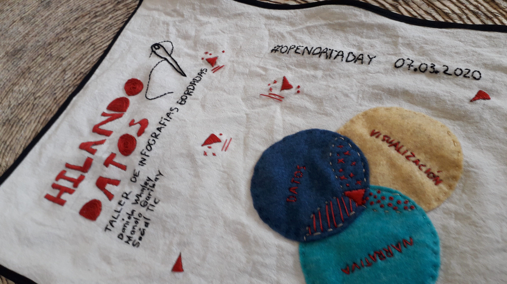

---
# Feel free to add content and custom Front Matter to this file.
# To modify the layout, see https://jekyllrb.com/docs/themes/#overriding-theme-defaults

layout: home
---

**Humanizar los datos a través del arte textil**

Hilando datos busca promover el cruce entre la visualización de datos y el
bordado, explorando nuevas formas de visualizar y contar historias basadas en
datos.

Aquí encontrarás ejercicios, metodologías y técnicas artísticas del dibujo y el
bordado para exploraras nuevas posibilidades en la visualización de datos.

<!---->

<iframe
  width="100%" height="420"
  src="https://www.youtube.com/embed/V9AbeALNVkk"
  frameborder="0" allow="accelerometer; autoplay; encrypted-media; gyroscope; picture-in-picture"
  allowfullscreen>
</iframe>

Una colaboración de
[Escuela de Datos](https://escueladedatos.online/),
[SocialTIC](https://socialtic.org/) y
[Agujas Combativas](https://agujascombativas.hotglue.me/).

Para conocer mejor el trabajo de Agujas Combativas puedes seguirles en sus
redes sociales:
- [Facebook](https://www.facebook.com/agujascombativas)
- [Instragam](https://www.instagram.com/agujascombativas/)
- [Sitio Web](https://agujascombativas.hotglue.me/)
