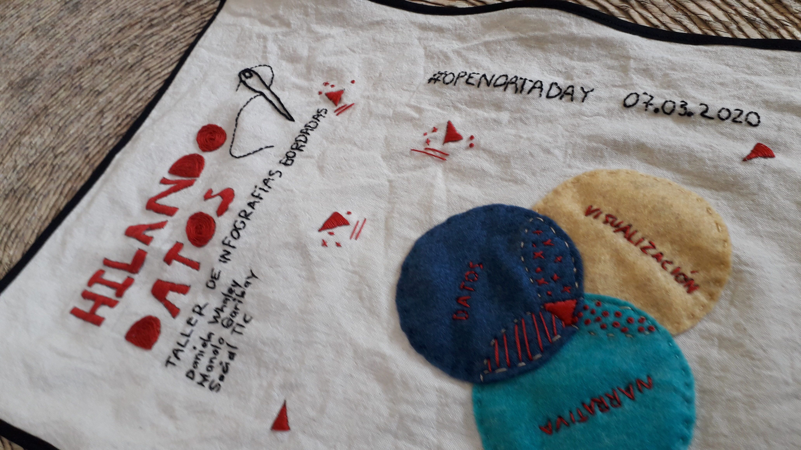

# Hilando datos

<ul>
  
    <li>
      <a href="{{ post.url }}">{{ post.title }}</a>
      {{ post.excerpt }}
    </li>
  
</ul>

## Humanizar los datos a través del arte textil

Hilando datos busca promover el cruce entre la visualización de datos y el bordado, explorando nuevas formas de visualizar y contar historias basadas en datos.

Encontrarás ejercicios, metodologías y técnicas artísticas del dibujo y el bordado para exploraras nuevas posibilidades en la visualización de datos.

  

Una colaboración de Escuela de datos, SocialTIC y Agujas Combativas.
